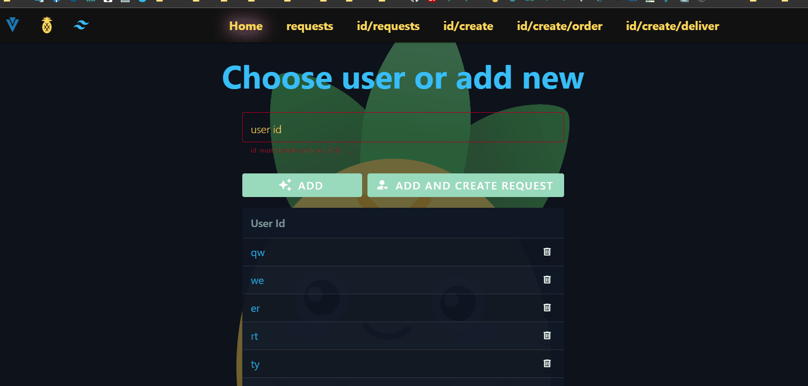
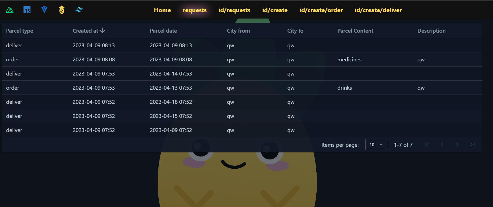
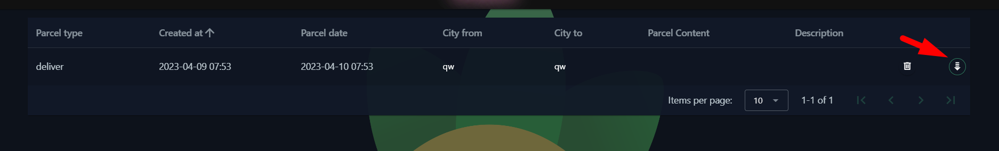
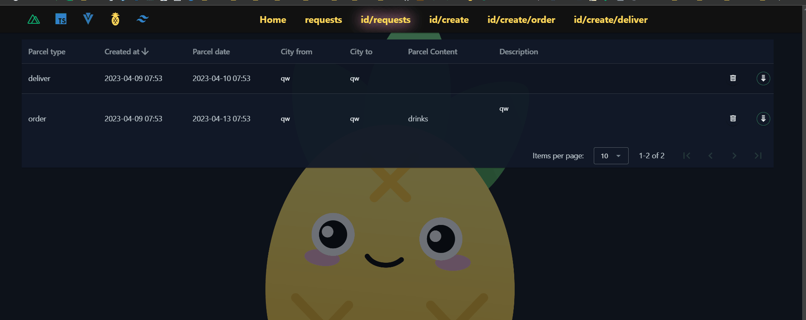
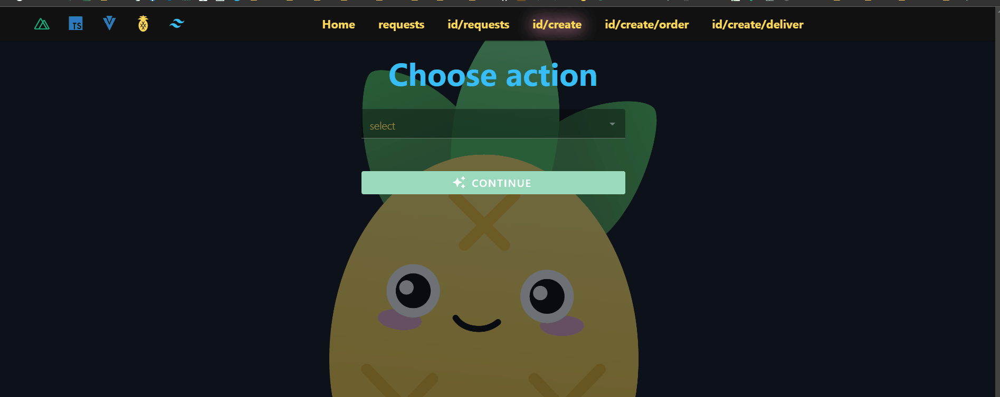

## Setup

```bash
yarn install

yarn dev
```
### At Home page you can:
* See existing users.
* Create new user. It must be [a-z,0-9,-,_] symbols
* If you press "Add", you stay in the page
* If you press "Add and create request" - you will be pushed to corresponding page
* Remove users
* Switch to any existing user



### Requests page:
#### It is simple list for each user each request. Here you can't edit data!

### IdRequests page you can:
* Change request date in popup
* Change cityFrom, cityTo. Just click in the table. To confirm - press enter or leave input. In field is invalid - changes will not be approved, and you will see warning. Also, you can press Esc to cancel changes.
* Change comment if it is allowed.
* See similar requests of other users from the right side. Click dropdown button.

* To simulate this - create one more user, add several requests with different dates but city always will the fame, like "qw"
* Sort, pagination, delete request.

### Also, we have few pages with forms:

